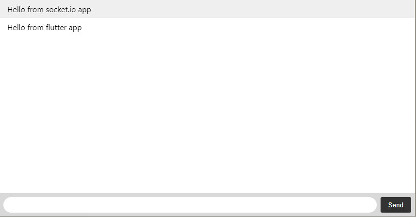

#### Host using XAMPP:
* Download and install XAMPP (if not already installed).
* Create a directory for the Socket.IO server (e.g., C:\xampp\htdocs\socket_server).
* Place your index.js file in the directory.
* Start the XAMPP Control Panel and launch Apache and MySQL (if needed).
* Open a terminal and navigate to the XAMPP directory, then start the server: node C:\xampp\htdocs\socket_server\index.js
* Ensure the server is accessible through the IP address or domain.
* You can now use the XAMPP-hosted Socket.IO server for signaling between devices.

